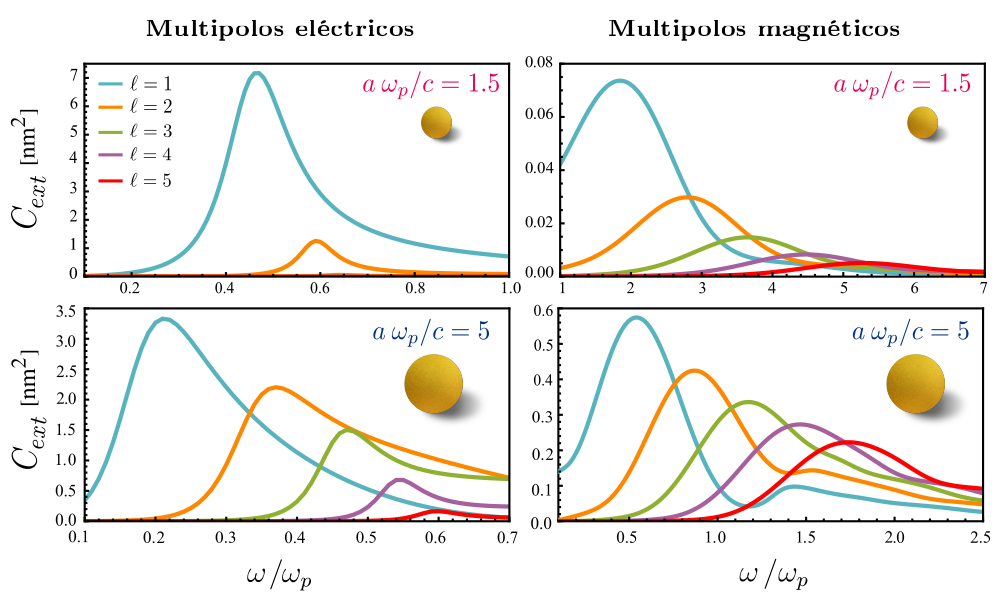

## Localización espectral de resonancias plasmónicas en nanoesferas tipo Drude de tamaño arbitrario
### **D. Larissa Luna Gonzáles**, J. A. Urrutia-Anguiano, A. Reyes-Coronado

Congreso Nacional de Física 2024 (CNF 2024)
Modalidad: Póster
Presentado: 10/10/2024

**Resumen:**
La **nanoplasmónica** es el estudio de la respuesta electromagnética en sistemas con respuesta metálica a la nanoescala, es decir, con dimensiones menores a 100 nm. En sistemas espacialmente confinados a esta escala, se presenta el fenómeno de **resonancia de plasmón de superficie localizado**, resultado del acoplamiento entre los electrones libres de un metal con el campo electromagnético incidente que ilumina al sistema. Éste fenómeno se puede emplear en aplicaciones como la espectroscopía y la medicina, debido a la sintonización de dichas resonancias a una frecuencia específica según las propiedades morfológicas del sistema. La **teoría de Mie** es una solución analítica a las ecuaciones de Maxwell que describe la excitación de la resonancia plasmónica de superficie para partículas metálicas esféricas iluminadas por una onda electromagnética plana mediante una suma de contribuciones multipolares de modos eléctricos y magnéticos, con los cuales puede calcularse la sección transversal de extinción, cuyo máximo corresponde a la excitación del plasmón de superficie localizado. En este trabajo, se estudia teórica y numéricamente la localización espectral de las resonancias plasmónicas excitadas en **partículas esféricas** caracterizadas por una función dieléctrica descrita por el **modelo de Drude** en función de su radio. Para determinar numéricamente la posición espectral de las resonancias plasmónicas de los primeros órdenes multipolares eléctricos y magnéticos, se calcula la sección transversal de extinción para cada uno de ellos, y se identifica la frecuencia que maximiza estas cantidades. Finalmente, se contrastan los resultados obtenidos con la condición de resonancia en el **límite de partícula pequeña}} obtenida analíticamente. Con base en los resultados, se presentan curvas del corrimiento al rojo de las resonancias plasmónicas de superficie localizadas para partículas esféricas conforme el límite de partícula pequeña deja de ser válido.

